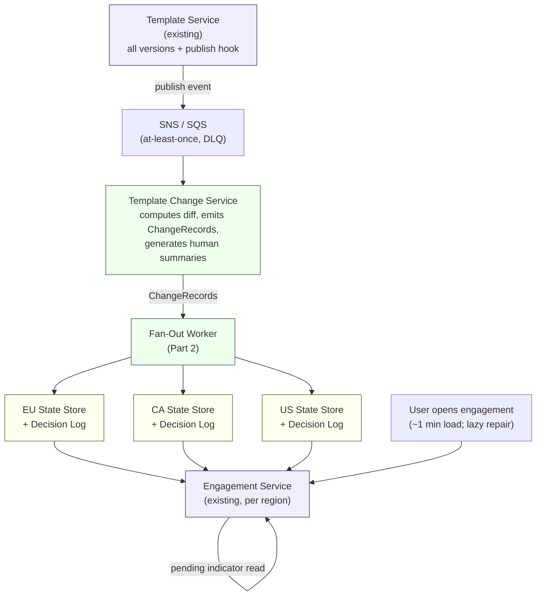

# Diagram 1 — End-to-end flow

```mermaid
flowchart TD
    TS["Template Service<br/>(existing)<br/>all versions + publish hook"]
    Q["SNS / SQS<br/>(at-least-once, DLQ)"]
    TCS["Template Change Service<br/>computes diff, emits ChangeRecords,<br/>generates human summaries"]
    FAN["Fan-Out Worker<br/>(Part 2)"]

    EU["EU State Store<br/>+ Decision Log"]
    CA["CA State Store<br/>+ Decision Log"]
    US["US State Store<br/>+ Decision Log"]

    ES["Engagement Service<br/>(existing, per region)"]
    USER["User opens engagement<br/>(~1 min load; lazy repair)"]

    TS -->|publish event| Q
    Q --> TCS
    TCS -->|ChangeRecords| FAN
    FAN --> EU
    FAN --> CA
    FAN --> US

    EU --> ES
    CA --> ES
    US --> ES

    ES -->|pending indicator read| ES
    USER --> ES

    classDef existing fill:#eef,stroke:#446,stroke-width:1px;
    classDef new fill:#efe,stroke:#464,stroke-width:1px;
    classDef store fill:#ffe,stroke:#664,stroke-width:1px;

    class TS,ES existing;
    class TCS,FAN new;
    class EU,CA,US store;
```