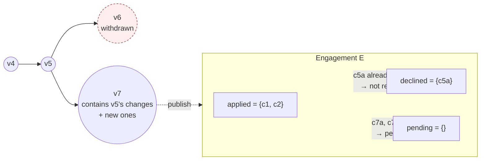

# Diagram 2 — Change graph with decline semantics

```mermaid
flowchart LR
    v4((v4)) --> v5((v5))
    v5 --> v6((v6<br/>withdrawn))
    v5 --> v7((v7<br/>contains v5's changes<br/>+ new ones))

    subgraph E["Engagement E"]
        direction TB
        A["applied = {c1, c2}"]
        D["declined = {c5a}"]
        P["pending = {}"]
    end

    v7 -.->|publish| E
    E -.->|"c5a already declined<br/>→ not re-offered"| D
    E -.->|"c7a, c7b new<br/>→ pending"| P

    classDef withdrawn fill:#fee,stroke:#a33,stroke-dasharray:4 3;
    class v6 withdrawn;
```