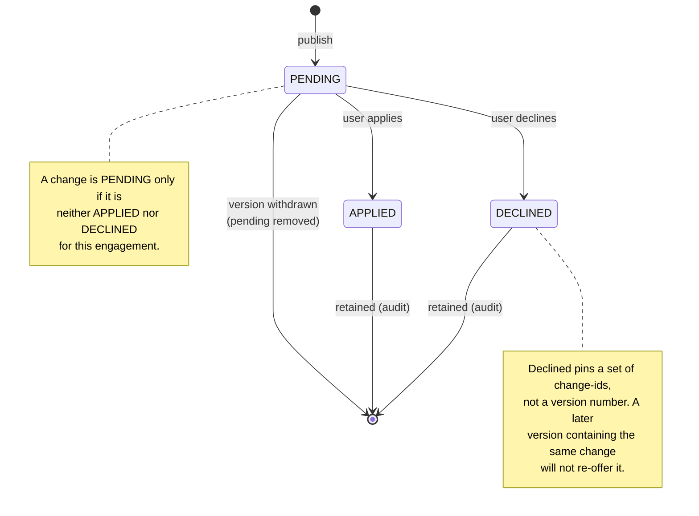

# Diagram 3 — State machine per engagement/change

```mermaid
stateDiagram-v2
    [*] --> PENDING: publish
    PENDING --> APPLIED: user applies
    PENDING --> DECLINED: user declines
    PENDING --> [*]: version withdrawn<br/>(pending removed)
    APPLIED --> [*]: retained (audit)
    DECLINED --> [*]: retained (audit)

    note right of PENDING
        A change is PENDING only if it is
        neither APPLIED nor DECLINED
        for this engagement.
    end note

    note right of DECLINED
        Declined pins a set of change-ids,
        not a version number. A later
        version containing the same change
        will not re-offer it.
    end note
```